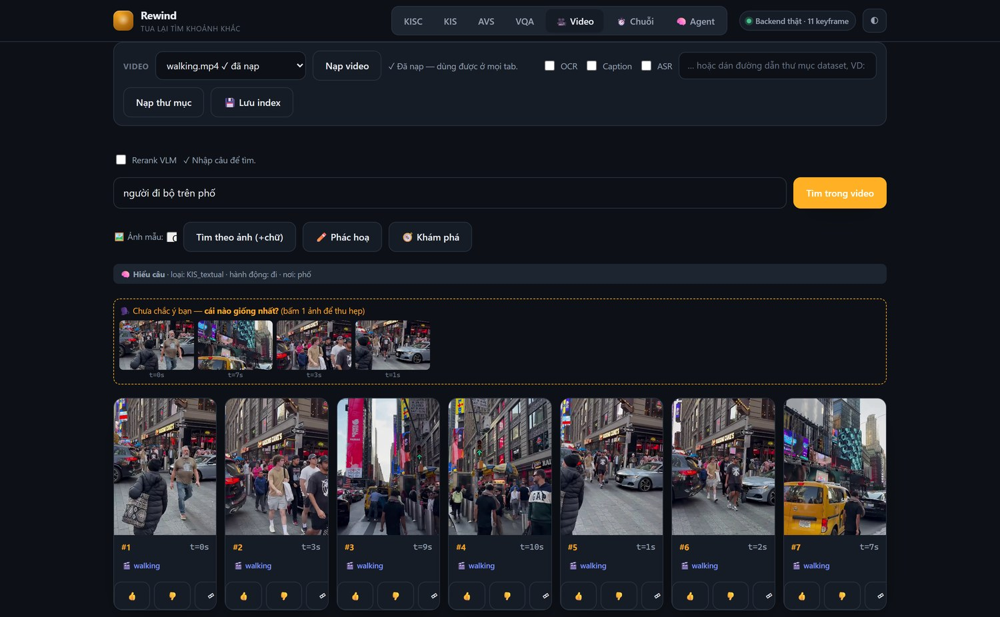
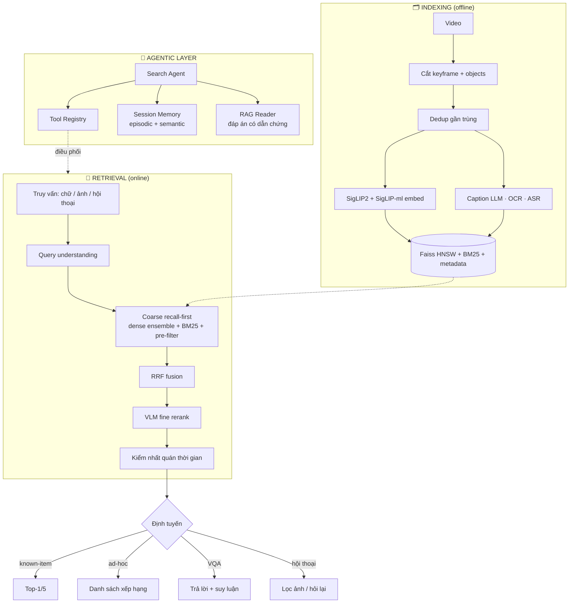
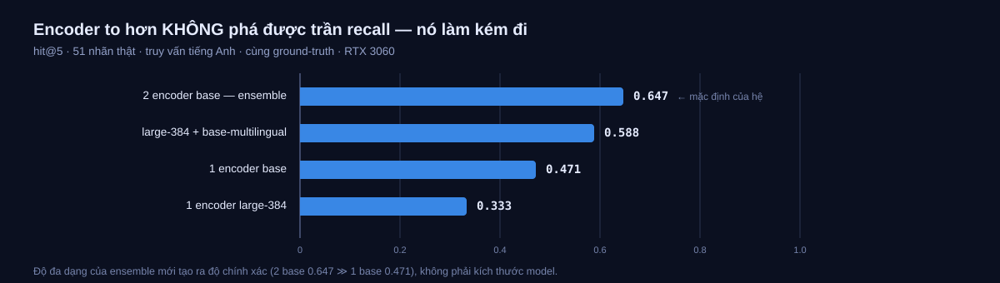
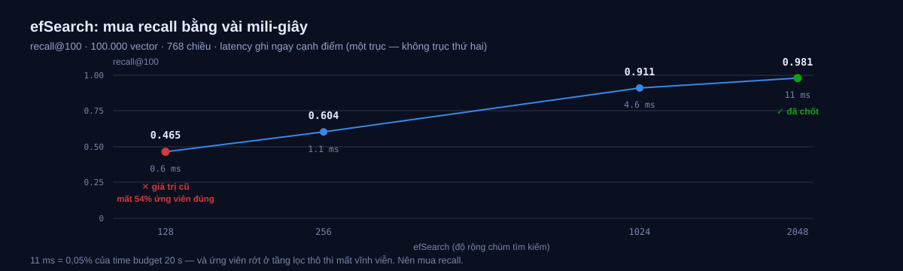

<p align="center">
  
</p>

<p align="center"><b>Tua lại tìm khoảnh khắc.</b><br/>
Công cụ tìm kiếm ngữ nghĩa cho video quy mô lớn — tìm bất kỳ khoảnh khắc nào bằng <em>lời mô tả</em>, <em>ảnh mẫu</em>, hoặc <em>hội thoại</em>.</p>

<p align="center">
  <a href="https://github.com/sai-ctruong/Rewind/actions/workflows/ci.yml"></a>
  
  
  
  
  
  
</p>

<p align="center">
  <a href="#-bắt-đầu-nhanh"><b>Bắt đầu</b></a> ·
  <a href="#-hai-cách-tìm">Cách tìm</a> ·
  <a href="#-kiến-trúc">Kiến trúc</a> ·
  <a href="#-tài-liệu">Tài liệu</a> ·
  <a href="#-số-đo-thật">Số đo</a>
</p>


## 🎬 Rewind là gì?

Rewind biến một kho video khổng lồ — từ vài giờ tới **hàng trăm giờ** (hàng triệu
keyframe) — thành thứ bạn **tra cứu theo ý nghĩa**, không phải tua tay hay lục theo tên
file. Mô tả khoảnh khắc cần tìm, đưa một **ảnh mẫu**, hoặc **trò chuyện** để hệ hỏi lại
thu hẹp dần — nó trả về đúng khung hình.

<table>
<tr>
<td width="50%" valign="top">

**🗣️ Tìm bằng lời** — *"người mặc áo đỏ ở quầy hoa quả"*

**🖼️ Tìm bằng ảnh / phác hoạ** — đưa ảnh mẫu → ra cảnh giống

</td>
<td width="50%" valign="top">

**⏱️ Tìm theo thứ tự** — *"cởi mũ **trước khi** vào phòng"*

**💬 Tìm bằng hội thoại** — hệ chủ động hỏi lại để khoanh vùng

</td>
</tr>
</table>

<p align="center">
  
</p>
<p align="center"><sub>Ảnh chụp thật — không dàn dựng: truy vấn <i>“người đi bộ trên phố”</i> trên video đã nạp.<br/>
Trên cùng là thanh video <b>nạp một lần, mọi tab dùng chung</b>; hệ hiện câu đã hiểu, và <b>chủ động hỏi lại</b> khi còn mơ hồ.</sub></p>


## 🎯 Bộ lọc ảnh — thu hẹp dần tới đúng khoảnh khắc

Khi bạn **khó mô tả đủ trong một câu**: cứ nói đại khái, rồi thu hẹp bằng **ảnh thật**.

<p align="center">
  
</p>

Ba tín hiệu thu hẹp, **dùng lẫn nhau tuỳ ý** trong cùng một lượt:

| Thao tác | Cơ chế |
|---|---|
| gõ thêm chi tiết | truy vấn cộng dồn |
| 👍 / 👎 trên ảnh | **Rocchio** — kéo về ảnh thích, ra xa ảnh không thích |
| chọn ảnh "gần ý nhất" khi hệ hỏi | ảnh chọn → 👍, các ảnh còn lại → 👎 |

Mỗi lượt chỉ xếp hạng lại **trong tập ứng viên hiện tại**, nên số ảnh **đảm bảo giảm** —
đúng mô hình một *bộ lọc*, không phải tìm lại từ đầu.


## 🧠 Hai cách tìm

<p align="center">
  
</p>

Rewind có **hai đường đi** trên cùng một bộ máy truy xuất:

<table>
<tr><th width="50%">⚡ Fast path — <code>VideoSearchEngine</code></th><th width="50%">🧠 Smart path — <code>SearchAgent</code></th></tr>
<tr valign="top">
<td>

Bạn chọn công cụ, gọi thẳng pipeline.

```python
engine.search(entry, "người đi bộ trên phố")
```

Nhanh, rõ ràng — hợp đa số truy vấn.

</td>
<td>

Bạn gõ một câu, **Agent tự quyết** dùng công cụ nào.

```python
agent.run("cởi mũ trước khi vào phòng")
# → ['understand', 'search_temporal', …]
```

Tự định tuyến · nhớ phản hồi xuyên lượt · trả lời kèm **trích dẫn keyframe** · và **cho
bạn xem nó đã gọi tool nào, vì sao**.

</td>
</tr>
</table>

> Agent là lớp **điều phối** trên chính các công cụ đã có — không cài lại thuật toán
> truy xuất. Chạy được **không cần API key** (bộ não luật, tất định); có
> `ANTHROPIC_API_KEY` thì tự nâng lên Claude function-calling.


## ✨ Điểm nổi bật

|  |  |
|---|---|
| 🧩 **Truy xuất recall-first nhiều tầng** | coarse (nhanh, giữ recall) → RRF fusion → VLM rerank → kiểm nhất quán thời gian |
| 🎯 **Bộ lọc ảnh hội thoại** | lưới ảnh thật co dần: mô tả · 👍/👎 · chọn ảnh gần ý nhất |
| 🧠 **Lớp Agentic** | Tool Registry · Search Agent · Session Memory · RAG Reader — **đều có trên UI** |
| ❓ **VQA trên video thật** | dùng chính câu hỏi định vị cửa sổ keyframe rồi mới trả lời |
| ⚡ **Sẵn sàng scale** | Faiss HNSW + metadata pre-filter · batch embed · lưu/nạp index · decode ‖ embed |
| 🤝 **Ensemble 2 encoder** | SigLIP2 + SigLIP đa ngôn ngữ — giảm "cùng sai", **Việt lẫn Anh** |
| 🔎 **Hybrid dense + sparse** | SigLIP trộn BM25 (OCR/ASR/caption) qua RRF, trọng số **thích ứng** |
| 🧪 **Mock-first** | mọi thứ cần GPU/API đều có bản Mock chạy **offline**; bản thật *lazy-import* |
| ✅ **273 unit test** | `pytest` chạy hoàn toàn offline (~7s) — không cần GPU/API key |


## 🏗️ Kiến trúc



> **Nguyên tắc:** *độ chính xác trên tốc độ*. Tầng lọc thô ưu tiên **recall cao** (không
> đánh mất ứng viên đúng), tầng rerank tối ưu precision. Mọi thứ **tính trước được** dồn
> vào lúc index; chỉ thứ phụ thuộc query mới tối ưu độ trễ.


## 🚀 Bắt đầu nhanh

```bash
# 1. Môi trường (Python 3.10+)
python -m venv .venv
.venv\Scripts\activate            # Windows · source .venv/bin/activate (Linux/macOS)
pip install -r requirements.txt

# 2. Chạy toàn bộ test — offline, không cần GPU/API
pytest                            # → 273 passed (~7s, không cần GPU)

# 3. Web demo (pipeline thật)
python -m ui.app                  # → http://127.0.0.1:5000
```

Bỏ video vào `data/videos/`, mở tab **🎥 Video** → **Nạp video** → tìm.

<details>
<summary><b>🎥 Tìm trên video thật bằng dòng lệnh (SigLIP local, không cần API key)</b></summary>

```bash
pip install -r requirements-full.txt      # torch + SigLIP + OCR (~5 GB)

python -m ingestion.video_ingest phim.mp4 --out artifacts/frames --every 1.0
python -m retrieval.video_search_demo phim.mp4 "người đang đi bộ trên phố" --topk 5
```
</details>

<details>
<summary><b>🧠 Lớp Agentic & bộ lọc ảnh từ code</b></summary>

```python
from retrieval.video_engine import VideoSearchEngine
from retrieval.search_agent import SearchAgent
from retrieval.image_filter import ImageFilterSession
from retrieval.vqa_module import MockReader, answer_on_video

engine = VideoSearchEngine()
entry  = engine.index_video("phim.mp4", "artifacts/frames")

# Agent tự định tuyến (offline; đổi sang ClaudePlanner/ClaudeReader khi có API key)
agent = SearchAgent(engine, entry, reader=MockReader())
run = agent.run("cảnh người cởi mũ trước khi vào phòng")
print(run.tools_used(), run.answer)

# Hội thoại có trí nhớ: lượt sau nhớ phản hồi lượt trước (Rocchio)
agent.chat("cảnh trên phố")
agent.chat("cảnh trên phố", positive_ids=["walking/7"])

# Bộ lọc ảnh: thu hẹp dần
s = ImageFilterSession(engine, entry, start_k=20)
s.start("cảnh đường phố")            # → 20 ảnh
s.refine(text="áo trắng")            # → ~10
s.refine(positive=["walking/7"])     # → ~5

# VQA: câu hỏi tự định vị cửa sổ keyframe rồi mới trả lời
ans, info = answer_on_video(engine, entry, "Có bao nhiêu người đi bộ?")
```
</details>


## 📊 Số đo thật

Benchmark trên **51 nhãn thật** (RTX 3060) — *đo, không đoán*:

| Cấu hình | Hit@1 | Hit@5 | MRR |
|---|:---:|:---:|:---:|
| coarse · BM25 cố định 1.0 | 0.275 | 0.647 | 0.438 |
| coarse · BM25 cố định 3.0 | 0.314 | 0.529 ↓ | 0.408 |
| **coarse · BM25 thích ứng** | 0.333 | **0.647** | 0.477 |
| **+ VLM rerank** | **0.549** | **0.667** | **0.604** |

**Đọc số:** VLM rerank là cú nhảy lớn nhất (**Hit@1 +0.22**). Trọng số BM25 cao *làm hại*
recall — nên mới có cơ chế **thích ứng theo loại truy vấn**. Hit@5 ~0.65 rất ổn định qua
mọi lần chạy — và ta đã **đo để biết vì sao**:

<p align="center">
  
</p>

> 🔬 **Giả thuyết "encoder to hơn thì recall cao hơn" — đã thử và BÁC BỎ.** Model large
> làm **kém đi**. Thứ tạo ra độ chính xác là **độ đa dạng của ensemble** (2 base = 0.647
> ≫ 1 base = 0.471), không phải kích thước model — đúng lý do chọn ensemble ngay từ đầu.
> Đã loại trừ mọi nghi vấn "dùng sai" trước khi kết luận: fp16 ≡ fp32, không NaN, padding
> SigLIP đúng, dedup không xoá mất đáp án, và so 1-đối-1 để không lẫn lợi thế ensemble.

### 0.65 KHÔNG phải trần truy xuất — nó là trần XẾP HẠNG

Đo sâu hơn cho thấy coarse **tìm được đáp án gần như luôn luôn**, chỉ là không đẩy nó lên đầu:

| Đáp án nằm trong… | top-1 | top-5 | top-10 | top-30 | **top-100** |
|---|:---:|:---:|:---:|:---:|:---:|
| % số lần | 0.372 | 0.627 | 0.608 | 0.824 | **0.902** |

**Encoder tìm ra đáp án 90% số lần** — vấn đề nằm ở việc *xếp hạng* nó lên top. Vậy để
VLM chấm lại **pool sâu hơn** thì sao? Cũng đã thử, cũng **bác bỏ**:

| `rerank_pool` | Hit@1 | Hit@5 | s/truy vấn |
|---|:---:|:---:|:---:|
| **8** (mặc định) | **0.510** | 0.608 | **4.7 s** |
| 16 | 0.471 | 0.608 | 6.9 s |
| 32 | 0.471 | 0.608 | 13.7 s |

Hit@5 **đứng im** ở mọi pool → 24 ứng viên thêm vào **chưa bao giờ** góp được đáp án
đúng; pool sâu chỉ thêm nhiễu và làm Hit@1 *tệ đi*. ⇒ Nút thắt thật là **khả năng phân
biệt của bộ chấm** (SigLIP ở coarse, Qwen2-VL-2B ở rerank), **không** phải kích thước
encoder, cũng **không** phải độ sâu pool. Đòn bẩy còn lại: **bộ rerank mạnh hơn**
(Claude vision) hoặc **caption LLM** — cả hai cần API key.

<details>
<summary>Số liệu dạng bảng (encoder)</summary>

| Cấu hình encoder | Hit@1 | Hit@5 | MRR |
|---|:---:|:---:|:---:|
| **2 encoder base — ensemble** (mặc định) | 0.353 | **0.647** | 0.482 |
| large-384 + base-multilingual | 0.255 | 0.588 | 0.399 |
| 1 encoder base | 0.333 | 0.471 | 0.388 |
| 1 encoder large-384 | 0.196 | 0.333 | 0.256 |

*51 nhãn thật · truy vấn tiếng Anh · cùng ground-truth · RTX 3060.*
`python -m evaluation.bench_retrieval --labels evaluation/labels_en.json --encoders`
</details>

### Tốc độ: nút thắt là **VRAM**, không phải model

| Cấu hình (pool=8, 51 nhãn thật) | s/truy vấn |
|---|---|
| SigLIP **vẫn nằm** trong VRAM cùng Qwen2-VL | **21.16 s** ❌ *vượt time budget 20 s* |
| **Đẩy SigLIP sang RAM** trước khi rerank | **4.03 s** ✅ **nhanh ×5.25** |

> 🔍 SigLIP (~1.45 GB) + Qwen2-VL-2B (~4.1 GB) **giành nhau 6 GB VRAM** — đỉnh chạm
> **6.06 GB = tràn**, GPU nghẹt nên rerank ì ạch **2.77 s/ứng viên**. Query đã encode
> **xong trước khi** rerank ⇒ encoder nhàn rỗi ⇒ đẩy nó sang RAM, rerank còn **0.48
> s/ứng viên**. Đổi lại đỉnh VRAM giảm **6.06 → 5.11 GB** — vừa nhanh hơn, vừa nhẹ hơn.
>
> Cũng thử **gộp nhiều ứng viên vào một lần `generate()`** — **chậm hơn ×0.17**, đã gỡ
> bỏ: VRAM đã nghẹt thì không còn chỗ để song song hoá.

### Còn "sẵn sàng scale" thì sao? — cũng đo, không nói suông

`evaluation/bench_scale.py` đo tầng ANN ở **768 chiều** (số chiều thật), tới 200k vector:

| Đo được | Kết quả | Nghĩa là |
|---|---|---|
| RAM | **3.343 B/vector** (tuyến tính) | 200k keyframe ≈ **2.4 GB** (×2 encoder) → thoải mái; 1M ≈ **12 GB** → **cần IVF-PQ** |
| Build index | 200k trong **43 s** | không phải nút thắt — **trích embedding** mới là (200k frame ≈ 7–14 h) |
| Latency coarse | **<1 ms → 11 ms** @200k | ~0,05% của time budget 20 s; VLM rerank mới chiếm phần lớn |

<p align="center">
  
</p>

> 🔴 **Benchmark này bắt được một lỗi cấu hình thật:** `efSearch=128` **âm thầm đánh mất
> ~54% ứng viên đúng** ở tầng lọc thô — vi phạm chính ràng buộc "không được mất recall ở
> coarse". Đã chốt **`efSearch=2048`**: recall **0.98**, trả giá **11 ms** (bằng 0,05%
> ngân sách). Kết luận vận hành: **HNSW float đúng cho tới ~300–400 giờ video**, quá mức
> đó mới cần IVF-PQ/sharding.

**Nguyên tắc:** tham số `[PROVISIONAL]` trong `configs/settings.yaml` chỉ được chốt sau khi
qua `bench_retrieval.py` (accuracy) hoặc `bench_scale.py` (quy mô) — **đo, không đoán**.


## 📚 Tài liệu

| Tài liệu | Dành cho |
|---|---|
| 🖥️ [`HUONG_DAN_GIAO_DIEN.md`](HUONG_DAN_GIAO_DIEN.md) | Dùng **giao diện web** — từng tab, từng nút, vòng phản hồi |
| 📘 [`HUONG_DAN.md`](HUONG_DAN.md) | Thao tác bằng **code/CLI** — bảng tra "muốn làm X → dùng gì" |
| 💬 [`kisc_module/`](kisc_module/) | Hội thoại thu hẹp bằng Information Gain |


## 🧠 Tech stack & lý do chọn

| Thành phần | Lựa chọn | Vì sao |
|-----------|----------|--------|
| Encoder | **SigLIP2** + **SigLIP đa ngôn ngữ** (ensemble) | Sigmoid loss ổn định, zero-shot tốt; ensemble giảm correlated errors |
| Vector search | **Faiss HNSW** (cosine) | Cân bằng tốc độ/chính xác, giữ float — ưu tiên accuracy |
| Sparse | **BM25** trên objects/OCR/ASR/caption | Bắt tín hiệu chữ (biển hiệu, lời nói) mà embedding bỏ sót |
| Fusion | **Reciprocal Rank Fusion** (k=60) | Gộp nhiều ranked list khác thang đo, không cần chuẩn hoá |
| Rerank & VQA | **Qwen2-VL** (local) / **Claude** vision | Cross-attention đọc *từng token* → hiểu quan hệ, thứ tự, số lượng |
| Phản hồi | **Rocchio** trên embedding | Vòng khám phá↔khai phá, không cần metadata thuộc tính |
| Bộ não Agent | **LLM function-calling** | Điều phối công cụ, suy luận nhiều bước, hội thoại |


## 🗺️ Trạng thái

| Nhóm | Nội dung | |
|---|---|:---:|
| Truy xuất | dedup · ingestion · Faiss HNSW · coarse · fusion · rerank · temporal | ✅ |
| Truy vấn | hiểu query · mở rộng · ảnh · sketch · đa phương thức · temporal | ✅ |
| Hiển thị | video browser · lân cận · gom cụm · explore · progress | ✅ |
| Phản hồi | Rocchio · gợi ý concept · **bộ lọc ảnh** · hỏi lại bằng ảnh | ✅ |
| Agentic | Tool Registry · Search Agent · Session Memory · RAG Reader | ✅ |
| VQA | trên video thật (cửa sổ theo câu hỏi) | ✅ |
| Scale/eval | batch embed · lưu/nạp index · benchmark harness · metrics | ✅ |

*Còn lại — đều chờ tài nguyên, không phải thiếu code:* caption LLM để phá trần recall ·
reasoning CoT/ToT (cần LLM) · IVF-PQ/sharding (khi profiling cho thấy RAM là nút thắt).


<p align="center">
  
</p>
<p align="center"><i>Rewind — tua lại tìm khoảnh khắc.</i></p>
<p align="center">
  <sub>Chạy offline bằng mock · cắm model/API thật là dùng · 273 test xanh</sub>
</p>
