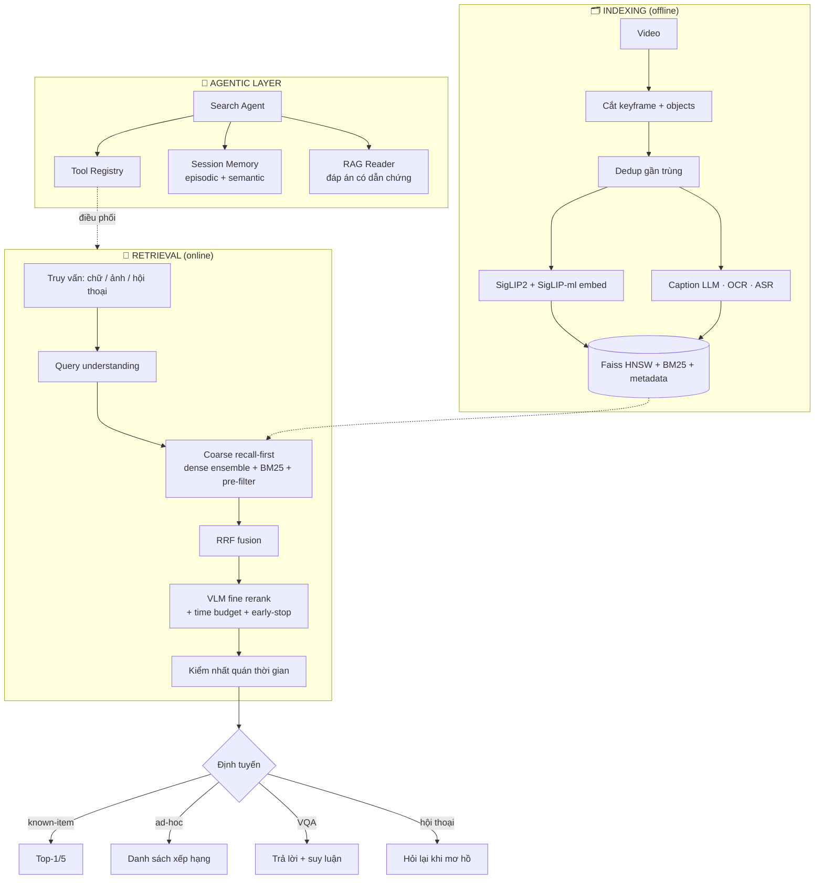

<p align="center">
  
</p>

<h1 align="center">Rewind</h1>
<p align="center"><b>Tua lại tìm khoảnh khắc.</b><br/>
Công cụ tìm kiếm ngữ nghĩa cho video quy mô lớn — tìm bất kỳ khoảnh khắc nào bằng <em>lời mô tả</em>, <em>ảnh mẫu</em>, hoặc <em>hội thoại</em>.</p>

<p align="center">
  
  
  
  
  
  
</p>

<p align="center">
  <a href="#-bắt-đầu-nhanh">Bắt đầu</a> ·
  <a href="#-điểm-nổi-bật">Chức năng</a> ·
  <a href="#-kiến-trúc">Kiến trúc</a> ·
  <a href="#-tài-liệu">Tài liệu</a>
</p>


## 🎬 Rewind là gì?

Rewind biến một kho video khổng lồ — từ vài giờ tới **hàng trăm giờ** (hàng triệu
keyframe) — thành thứ bạn có thể **tra cứu theo ý nghĩa**, không phải tua tay hay lục theo
tên file. Bạn mô tả khoảnh khắc cần tìm (*"người lớn hướng dẫn trẻ em tưới hoa ở quầy bán
hoa quả"*), đưa một **ảnh mẫu**, hoặc **trò chuyện** để hệ thống hỏi lại thu hẹp dần — và
nó trả về đúng khung hình.

Điểm khác biệt: Rewind không dừng ở "so khớp vector". Trên nền truy xuất nhiều tầng là một
**lớp agentic** — một bộ điều phối dùng LLM tự quyết nên gọi công cụ nào, **ghi nhớ hội
thoại xuyên nhiều lượt**, và **tổng hợp câu trả lời có dẫn chứng** thay vì trả về lưới ảnh
trần.

<table>
<tr>
<td width="50%" valign="top">

**🗣️ Tìm bằng lời**
> *"người mặc áo đỏ đứng ở quầy hoa quả"*

**🖼️ Tìm bằng ảnh / phác hoạ**
> đưa một ảnh mẫu → ra cảnh giống

</td>
<td width="50%" valign="top">

**⏱️ Tìm theo thứ tự thời gian**
> *"cởi mũ **trước khi** vào phòng"*

**💬 Tìm bằng hội thoại**
> hệ chủ động hỏi lại để khoanh vùng

</td>
</tr>
</table>

> **Nguyên tắc thiết kế cốt lõi:** *độ chính xác đặt trên tốc độ*. Tầng lọc thô ưu tiên
> **recall cao** (không đánh mất ứng viên đúng), tầng rerank tối ưu precision. Mọi thứ
> **tính trước được** dồn vào lúc index (offline); chỉ thứ phụ thuộc query mới tối ưu độ trễ.


## ✨ Điểm nổi bật

|  |  |
|---|---|
| 🧩 **Truy xuất recall-first nhiều tầng** | coarse (nhanh, giữ recall) → RRF fusion → VLM rerank → kiểm nhất quán thời gian |
| 🧠 **Lớp Agentic** | Tool Registry · Search Agent (observe→reason→act) · Session Memory · RAG Reader |
| ⚡ **Sẵn sàng scale** | Faiss HNSW + metadata pre-filter, coarse cỡ mili-giây · batch embed · lưu/nạp index · pipeline decode ‖ embed |
| 🤝 **Ensemble 2 encoder** | SigLIP2 + SigLIP đa ngôn ngữ — giảm "cùng sai", **Việt lẫn Anh** |
| 🔎 **Hybrid dense + sparse** | SigLIP (thị giác) trộn BM25 (OCR/ASR/caption) qua RRF, trọng số **thích ứng** |
| 🧪 **Mock-first** | mọi thành phần cần GPU/API đều có bản Mock chạy **offline**; bản thật *lazy-import* |
| ✅ **243 unit test** | `pytest` chạy hoàn toàn offline — kể cả vòng lặp Agent |


## 🏗️ Kiến trúc



**Hai đường đi.** *Fast path* (`engine.search`) chạy pipeline truy xuất trực tiếp cho đa
số truy vấn. *Smart path* (`SearchAgent`) đặt một bộ não LLM lên trên: nó **điều phối**
chính các công cụ đó cho những truy vấn khó, hội thoại, hay cần suy luận nhiều bước — chứ
không cài lại thuật toán truy xuất.


## 🚀 Bắt đầu nhanh

```bash
# 1. Môi trường (Python 3.10+)
python -m venv .venv
.venv\Scripts\activate            # Windows · source .venv/bin/activate (Linux/macOS)
pip install -r requirements.txt

# 2. Chạy toàn bộ test — offline, không cần GPU/API
pytest                            # → 243 passed

# 3. Web demo (nối pipeline thật)
python -m ui.app                  # → http://127.0.0.1:5000
```

<details>
<summary><b>🎥 Tìm kiếm trên video thật (SigLIP local, không cần API key)</b></summary>

```bash
pip install opencv-python-headless torch transformers sentencepiece protobuf pillow

# Cắt keyframe từ video
python -m ingestion.video_ingest phim.mp4 --out artifacts/frames --every 1.0

# Truy vấn bằng chữ (SigLIP cross-modal — cùng không gian với ảnh)
python -m retrieval.video_search_demo phim.mp4 "người đang đi bộ trên phố" --topk 5
```
</details>

<details>
<summary><b>🧠 Dùng lớp Agentic từ code</b></summary>

```python
from retrieval.video_engine import VideoSearchEngine
from retrieval.search_agent import SearchAgent
from retrieval.vqa_module import MockReader

engine = VideoSearchEngine()
entry  = engine.index_video("phim.mp4", "artifacts/frames")

# MockReader chạy offline; đổi sang ClaudePlanner/ClaudeReader khi có ANTHROPIC_API_KEY
agent = SearchAgent(engine, entry, reader=MockReader())

run = agent.run("cảnh người cởi mũ trước khi vào phòng")
print(run.tools_used())      # ['understand', 'search_temporal', ...] — Agent tự định tuyến
print(run.answer)            # câu trả lời có trích dẫn keyframe

# Hội thoại có trí nhớ: lượt sau nhớ phản hồi lượt trước (Rocchio)
agent.chat("cảnh trên phố")
agent.chat("cảnh trên phố", positive_ids=["kf_42"])   # 👍 → kéo kết quả về hướng này
```
</details>


## 📚 Tài liệu

| Tài liệu | Dành cho |
|---|---|
| 📘 [`HUONG_DAN.md`](HUONG_DAN.md) | Cẩm nang thao tác bằng **code/CLI** — bảng tra "muốn làm X → dùng gì", đi qua từng chức năng |
| 🖥️ [`HUONG_DAN_GIAO_DIEN.md`](HUONG_DAN_GIAO_DIEN.md) | Hướng dẫn dùng **giao diện web** — từng tab, từng nút, vòng phản hồi |
| 💬 [`kisc_module/`](kisc_module/) | Module hội thoại thu hẹp bằng Information Gain |


## 🧠 Tech stack & lý do chọn

| Thành phần | Lựa chọn | Vì sao |
|-----------|----------|--------|
| Encoder đa phương thức | **SigLIP2** + **SigLIP đa ngôn ngữ** (ensemble) | Sigmoid loss ổn định, zero-shot tốt; ensemble giảm correlated errors |
| Vector search | **Faiss HNSW** (cosine) | Cân bằng tốc độ/chính xác, giữ float — ưu tiên accuracy |
| Sparse retrieval | **BM25** trên objects/OCR/ASR/caption | Bắt tín hiệu chữ (biển hiệu, lời nói) mà embedding bỏ sót |
| Score fusion | **Reciprocal Rank Fusion** (k=60) | Gộp nhiều ranked list khác thang đo, không cần chuẩn hoá |
| VLM rerank & VQA | **Qwen2-VL** (local) / **Claude** vision | Cross-attention đọc *từng token* → hiểu quan hệ, thứ tự, số lượng |
| Bộ não Agent | **LLM function-calling** (Anthropic) | Điều phối công cụ, suy luận nhiều bước, hội thoại |


## 🗺️ Trạng thái

| Nhóm | Nội dung | |
|---|---|:---:|
| Truy xuất | dedup · ingestion · Faiss HNSW · coarse · fusion · rerank · temporal | ✅ |
| Truy vấn | hiểu query · mở rộng · ảnh · sketch · đa phương thức · temporal | ✅ |
| Hiển thị | video browser · lân cận · gom cụm · explore · progress | ✅ |
| Phản hồi | relevance feedback (Rocchio) · gợi ý concept · hội thoại KISC | ✅ |
| Agentic | Tool Registry · Search Agent · Session Memory · RAG Reader | ✅ |
| Scale/eval | batch embed · lưu/nạp index · benchmark harness · metrics | ✅ |

*Còn lại:* reasoning nhiều nhánh CoT/ToT (đợi API) · VQA trên video dài thật · IVF-PQ/sharding khi cần profiling quy mô lớn.


<p align="center">
  
</p>
<p align="center"><i>Rewind — tua lại tìm khoảnh khắc.</i></p>
<p align="center">
  <sub>Chạy offline bằng mock · cắm model/API thật là dùng · 243 test xanh</sub>
</p>
