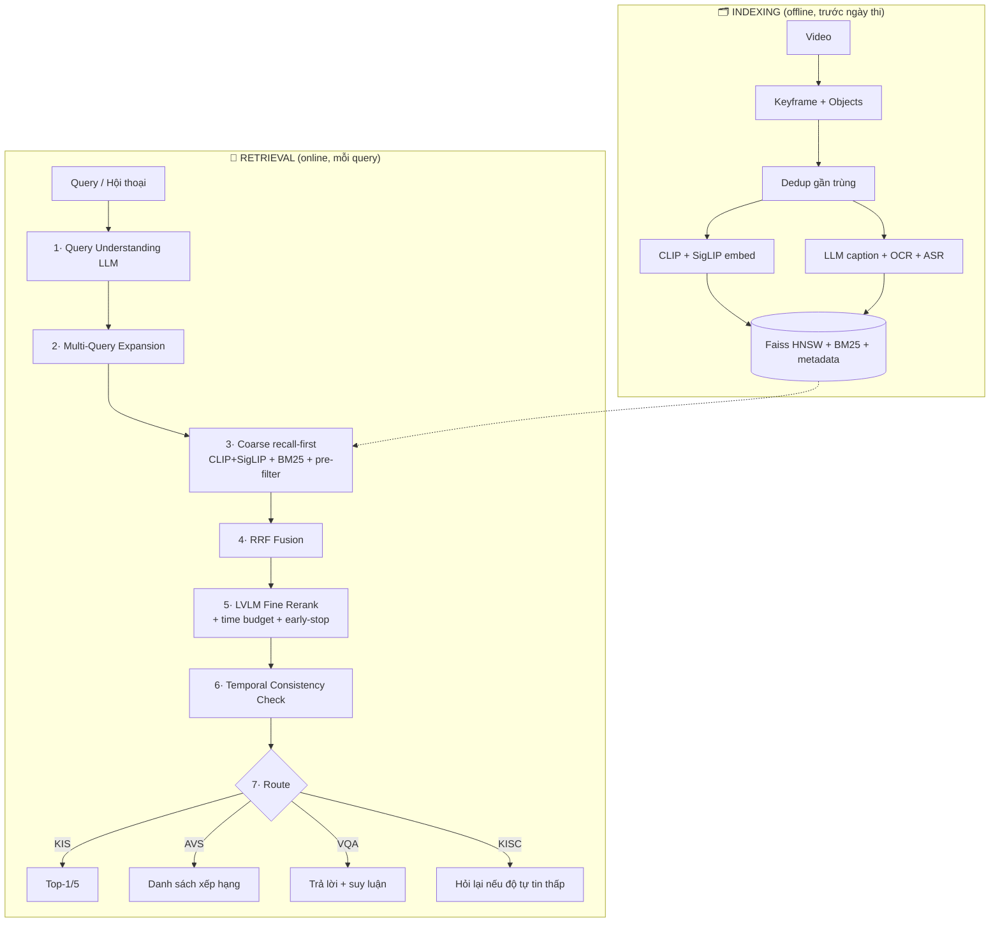

<div align="center">

# 🎬 Trợ lý ảo Truy xuất Đa phương tiện — AIC 2026

**Hệ thống tìm kiếm video/lifelog thông minh cho Hội thi AI Challenge TP.HCM 2026**
*Mô phỏng thể thức Lifelog Search Challenge (LSC) & Video Browser Showdown (VBS)*


</div>

---

## 📖 Giới thiệu

Hệ thống xử lý **4 dạng bài toán** truy xuất trên kho video từ vài giờ tới **vài trăm giờ** (ước tính hàng triệu keyframe):

| Dạng | Input | Output |
|------|-------|--------|
| 🎯 **KIS** — Known-Item Search | 1 mô tả / đoạn mẫu | Top-1/Top-5 keyframe chính xác tuyệt đối |
| 🔍 **AVS** — Ad-hoc Video Search | Mô tả tổng quát | Danh sách **tất cả** đoạn khớp, xếp hạng |
| ❓ **VQA** — Video QA | Video + câu hỏi | Câu trả lời có suy luận (đếm, thứ tự thời gian) |
| 💬 **KISC** — Conversational KIS | Hội thoại nhiều lượt | Trợ lý **chủ động hỏi lại** để thu hẹp phạm vi |

> **Nguyên tắc số 1:** Độ chính xác > tốc độ. Pipeline nhiều tầng, tầng lọc thô ưu tiên **recall cao** (không bao giờ đánh mất ứng viên đúng), tầng rerank tối ưu precision.

---

## ✨ Điểm nổi bật

- 🧩 **Kiến trúc multi-stage** recall-first: coarse (nhanh, giữ recall) → fusion → LVLM rerank (chính xác) → temporal check.
- ⚡ **Scale-ready**: Faiss HNSW + metadata pre-filter, coarse search **9–25 ms** trên 1.5k–5k keyframe.
- 🤝 **Ensemble 2 encoder** (CLIP + SigLIP) giảm rủi ro "cùng sai".
- 🧪 **Mock-first**: mọi thành phần cần GPU/API đều có bản Mock chạy **offline**, bản thật viết sẵn *lazy-import* — cắm dữ liệu thật là chạy.
- 💬 **KISC** hội tụ trung bình **2 lượt** hội thoại (Information Gain / entropy).
- 🎨 **Web UI** đẹp, 2 theme, nối thẳng pipeline thật.
- ✅ **130 unit test** xanh, chạy `pytest` hoàn toàn offline.

---

## 🏗️ Kiến trúc pipeline



---

## 📂 Cấu trúc dự án

```
aic2026_system/
├── kisc_module/          💬 Module hội thoại KISC (Information Gain)
├── ingestion/            🗂️  Dedup · embed CLIP/SigLIP · OCR/ASR · caption · build_index
├── retrieval/            🔎 Query understanding/expansion · coarse · fusion · rerank
│                            · temporal_check · vqa_module · kisc_adapter
├── evaluation/           📊 metrics (Recall@K, MRR, mAP, nDCG, EM, F1) · run_eval
├── ui/                   🎨 app.py (Flask) · index.html (web demo đẹp)
├── tests/                ✅ 130 unit test (pytest, offline)
├── configs/settings.yaml ⚙️  Ngưỡng tập trung (đánh dấu [PROVISIONAL]/[FIXED])
└── CLAUDE.md             📘 Blueprint kỹ thuật đầy đủ
```

---

## 🚀 Bắt đầu nhanh

```bash
# 1. Tạo môi trường (Python 3.10+; dự án dùng 3.14)
py -3.14 -m venv .venv
.venv\Scripts\activate            # Windows
pip install -r requirements.txt

# 2. Chạy toàn bộ test (offline, không cần GPU/API)
pytest                            # → 130 passed

# 3. Mở web demo (nối pipeline thật)
python -m ui.app                  # → http://127.0.0.1:5000

# 4. Báo cáo đánh giá end-to-end
python -m evaluation.run_eval

# 5. Demo hội thoại KISC
python -m kisc_module.demo             # bản gốc (mock)
python -m retrieval.kisc_real_demo     # trên retriever thật
```

> 💡 Trên Windows, nếu console vỡ tiếng Việt: đặt `set PYTHONUTF8=1`.

---

## 🖥️ Web demo

Trang demo có **3 chế độ** — nối thẳng pipeline thật qua Flask, hoặc chạy **mô phỏng** độc lập trong trình duyệt:

| Chế độ | Mô tả |
|--------|-------|
| 💬 **Hội thoại KISC** | Mô tả khoảnh khắc → trợ lý hỏi thu hẹp; bộ đếm ứng viên giảm dần theo thời gian thực |
| 🔍 **Tìm kiếm** | Truy vấn ngôn ngữ tự nhiên → kết quả xếp hạng kèm thuộc tính |
| ❓ **Hỏi–đáp VQA** | Đếm số lượng, xác định "ai làm gì" trên cửa sổ keyframe |

---

## 🧠 Tech stack & quyết định thiết kế

| Thành phần | Lựa chọn | Vì sao |
|-----------|----------|--------|
| Multimodal encoder | **CLIP** (BTC cấp) + **SigLIP** (ensemble) | Giảm correlated errors, tăng accuracy không cần model lớn |
| Vector search | **Faiss HNSW** (cosine) | Cân bằng tốc độ/chính xác, giữ float (ưu tiên accuracy) |
| Sparse retrieval | **BM25** trên objects/OCR/ASR/caption | Bắt tín hiệu chữ/ngữ nghĩa embedding bỏ sót |
| Score fusion | **Reciprocal Rank Fusion** (k=60) | Gộp nhiều ranked list khác thang đo, không cần chuẩn hoá |
| LVLM rerank & VQA | **Claude** (vision) | Suy luận quan hệ ngữ nghĩa; giới hạn là **độ trễ**, không phải chi phí |
| Data enrichment | **LLM auto-captioning** lúc indexing | Nắm quan hệ tương tác mà object detector rời rạc bỏ lỡ |

---

## 📊 Đánh giá

`evaluation/metrics.py` cung cấp: **Recall@K · Hit@K · MRR · Average Precision (mAP) · nDCG** cho KIS/AVS; **Exact Match · token F1** cho VQA. `run_eval.py` sinh bộ test có nhãn, chạy end-to-end và in báo cáo + lưu JSON.

---

## 🧪 Triết lý Mock-first

> *"Mọi module chạy được offline bằng mock data trước khi cắm dữ liệu/GPU/API thật."*

Mỗi thành phần cần tài nguyên nặng đều theo mẫu **`ABC` (interface) + `Mock*` (offline) + bản thật (lazy-import)**:

```
Encoder / OCR / ASR / Captioner / Reranker / VQA Answerer / Query Understander
   └─ interface ──┬── MockXxx        → chạy ngay, test offline (numpy)
                  └── XxxThật (lazy) → import torch/anthropic/... chỉ khi dùng
```

### 🎥 Xử lý video THẬT (SigLIP, không cần API key)

Mắt xích `video.mp4 → keyframe → embedding → tìm kiếm` đã chạy thật bằng model local (miễn phí, chỉ cần tải model lần đầu):

```bash
pip install opencv-python-headless torch transformers sentencepiece protobuf pillow

# Cắt keyframe từ video
python -m ingestion.video_ingest phim.mp4 --out artifacts/frames --every 1.0

# Tìm kiếm bằng chữ trên video thật (SigLIP cross-modal, không cần API)
python -m retrieval.video_search_demo phim.mp4 "người đang đi bộ trên phố" --topk 5
```

> ✅ Đã kiểm chứng: trên clip 3 cảnh (CAT/DOG/CAR), truy vấn *"a photo of a car"* → trả về đúng khung hình CAR. `ingestion/video_ingest.py` (cv2) cắt keyframe + bỏ frame trùng; `SiglipEncoder.encode_text()` mã hoá query cùng không gian ảnh.

**Độ chính xác nâng cao** (`retrieval/video_engine.py`): ensemble **SigLIP2 + SigLIP-multilingual** fuse bằng RRF (Mục 2.1) · **query prompt ensemble** — trung bình embedding nhiều biến thể câu (Mục 4.2) · lấy mẫu dày 0.5s + **dedup ngữ nghĩa** (Mục 5.1). Hỗ trợ **tiếng Việt lẫn tiếng Anh**. Benchmark trước/sau: `python -m evaluation.bench_video_engine` (Mục 11.3).

**Tìm bằng CHỮ trên biển hiệu (OCR)** (`ingestion/ocr_asr_extract.py::EasyOcrEngine`): SigLIP hiểu hình ảnh nhưng không đọc chữ cụ thể. EasyOCR (GPU, tiếng Việt+Anh) đọc chữ trên mỗi keyframe → index vào **BM25**; khi truy vấn, RRF gộp dense (SigLIP) + sparse (OCR, trọng số cao hơn) → tìm được cả cảnh lẫn text/biển hiệu (VD "NEW YORK", "SEPHORA"). Bật mặc định (`enable_ocr=True`).

**Rerank bằng VLM local — hiểu từng chữ + ngữ cảnh** (`retrieval/vlm_rerank.py`, Mục 4.4): bật tuỳ chọn (checkbox "Rerank VLM" trên UI, hoặc `search(..., rerank=True)`). SigLIP là dual-encoder (nén cả câu thành 1 vector, yếu về tổ hợp từ); **Qwen2-VL-2B** dùng cross-attention đọc ảnh + *từng token* câu → suy luận đúng quan hệ/thứ tự/số lượng, **đa ngôn ngữ**. Kiến trúc 2 tầng: coarse SigLIP (nhanh, recall) → VLM rerank top-K (chậm trên CPU, chính xác). **Không cần API key** (model chạy local).

### 🔌 Cắm dữ liệu thật (khi có tài nguyên)

1. Chuẩn bị **video + CLIP feature BTC** và đặt `ANTHROPIC_API_KEY`.
2. `pip install torch transformers faiss-cpu openai-whisper paddleocr anthropic`.
3. Đổi `Mock*` → bản thật (không đổi interface): `SiglipEncoder`, `PaddleOcrEngine`, `WhisperAsrEngine`, `ClaudeCaptioner`, `ClaudeReranker`, `ClaudeVqaAnswerer`, `ClaudeQueryUnderstander`.
4. **Benchmark** các tham số `[PROVISIONAL]` trong `configs/settings.yaml` (efSearch, top-K, time_budget) theo Mục 11.3 — không đoán số.

---

## 🗺️ Trạng thái roadmap

| Phase | Nội dung | | Phase | Nội dung | |
|:---:|---|:---:|:---:|---|:---:|
| 0 | Scaffold + config | ✅ | 6 | Temporal consistency check | ✅ |
| 1 | Deduplication | ✅ | 7 | VQA module | ✅ |
| 2 | Ingestion pipeline | ✅ | 8 | Tích hợp KISC (retriever thật) | ✅ |
| 3 | Faiss HNSW + coarse | ✅ | 9 | Evaluation metrics | ✅ |
| 4 | Query understanding | ✅ | 10 | Web UI | ✅ |
| 5 | Fusion + LVLM rerank | ✅ | | **Tổng** | **130 test ✓** |

---

## 📜 Ràng buộc không thương lượng

1. 🎯 **Accuracy > speed** — chấp nhận pipeline nhiều tầng miễn nằm trong time budget.
2. 🔒 **Không mất recall ở tầng lọc thô** — ứng viên bị loại ở coarse không bao giờ được xét lại.
3. 📈 **Scale-ready** — không brute-force khi > ~50.000 vector.
4. 🐍 Python 3.10+, type hints, docstring giải thích **lý do** thiết kế.
5. 🧪 Mọi module có unit test, chạy offline bằng mock.

---

<div align="center">

📘 Xem [`CLAUDE.md`](CLAUDE.md) để biết đặc tả kỹ thuật đầy đủ · 💬 [`kisc_module/`](kisc_module/) cho chi tiết module hội thoại

*Xây dựng cho Hội thi AI Challenge TP.HCM 2026*

</div>
